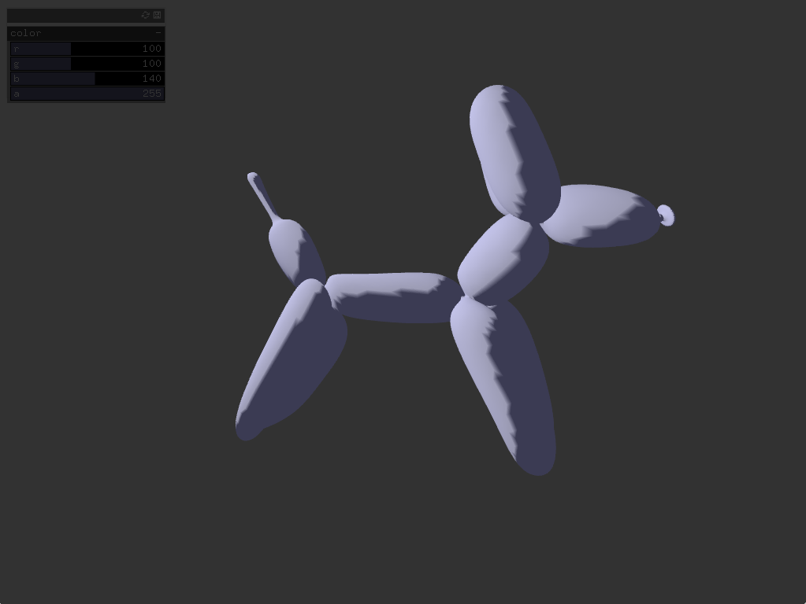
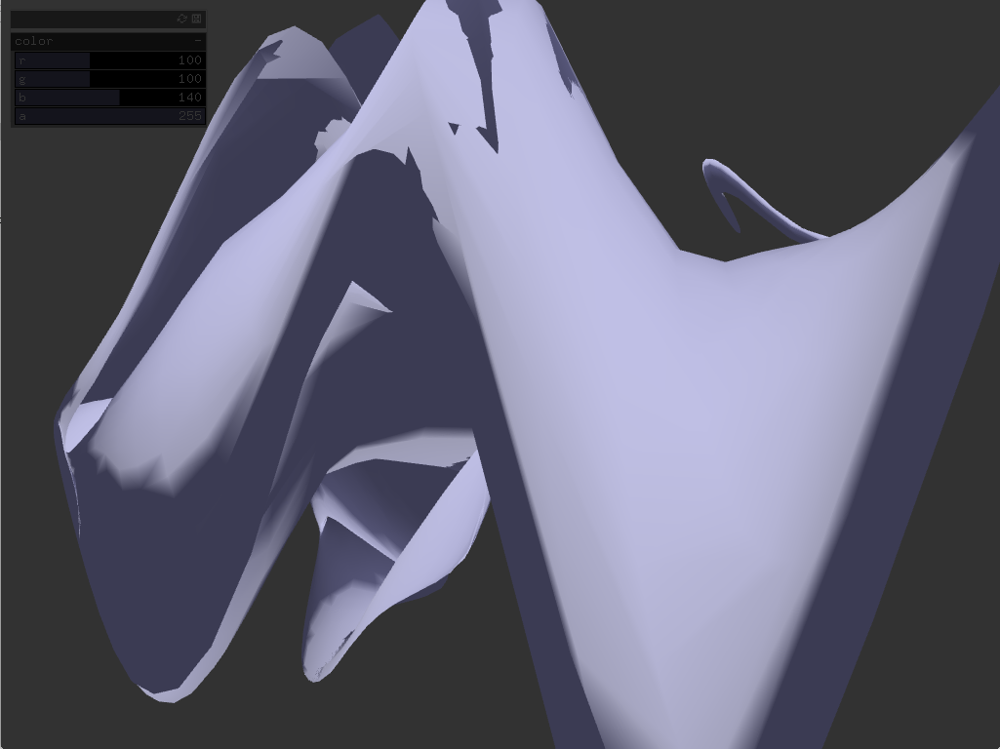

#Baloon Animal Color

This program is a study in Graphical User Interfaces. 

For this assignment, I added GUI sliders to James George's prgram, "ModelNoiseExample. The sliders in the top left change the transparency and the color of the model. The mouse position changes the appearence of the mesh. Enjoy! 

